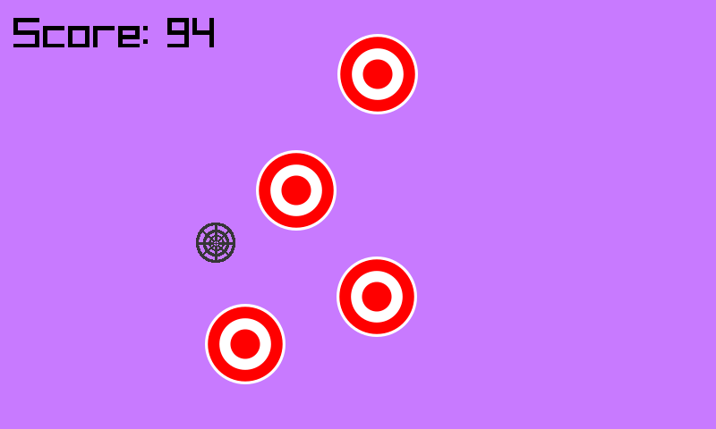

# Shoot The Targets (C Edition)

This is an experiment in porting my other Shoot The Targets game into C using raylib.
It's now far exceeded that original C# version.

## Building

You'll need to install raylib, then it's just a `make` and that should do it for you.
